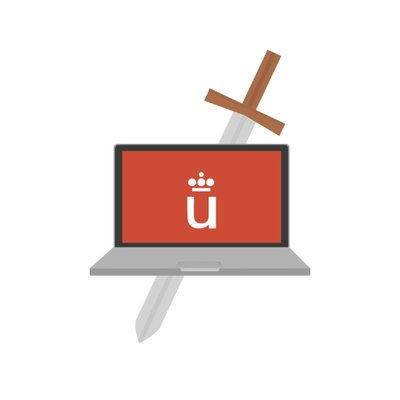

[](https://sonarcloud.io/dashboard?id=URJC-CP_iudex) [](https://sonarcloud.io/dashboard?id=rmartinsanta_mork)
[](https://sonarcloud.io/dashboard?id=URJC-CP_iudex) [](https://sonarcloud.io/dashboard?id=rmartinsanta_mork)

iudex
--------

Iudex es una aplicación web de código libre desarrollada para impartir clases de programación, algoritmos y bases de datos. Es una aplicación de código
libre extensible, cualquiera puede utilizarlo y puede tener distintos tipos de usos.

|          Juez         | Gratuito | Código Libre | Organizar   Concursos |   Lenguajes   | Uso educativo |
|:---------------------:|:--------:|:------------:|:---------------------:|:-------------:|:-------------:|
|      Open Kattis      |    SI    |      NO      |           NO          |       21      |       NO      |
|         Kattis        |    NO    |      NO      |      SI, de pago      |       21      |       NO      |
| Universities   Kattis |    NO    |      NO      |      SI, de pago      |       21      |       SI      |
|          SPOJ         |    SI    |      NO      | SI, con restricciones |   más de 60   |       SI      |
|      Online Judge     |    SI    |      NO      |           NO          |       4       |       NO      |
|       Codeforces      |    SI    |      NO      | SI, con restricciones |       17      |       NO      |
|        DOMJudge       |    SI    |      SI      |           SI          |       8       |       SI      |
|        TOPCoder       |    SI    |      NO      |      SI, de pago      |       5       |       NO      |
|     Acepta el Reto    |    SI    |      NO      |           NO          |       3       |       NO      |
|         Iudex         |    SI    |      SI      |           SI          | 2, ampliables |       SI      |


Vídeo de aplicación
-------------


Documentación
-------------

Pronto se hará una documentación sobre sobre la instalación, los requisitos y arquitectura del sistema.
Los trabajos realizados sobre iudex se pueden observar en los siguientes enlaces:

* [1. Arquitectura de iudex basada en contenedores](https://github.com/URJC-CP/iudex/blob/master/docs/1.%20Arquitectura%20de%20iudex%20basada%20en%20contenedores.pdf)
* [2. Plataforma de análisis automática de código](https://github.com/URJC-CP/iudex/blob/master/docs/2.%20Plataforma%20de%20an%C3%A1lisis%20autom%C3%A1tica%20de%20c%C3%B3digo.pdf)
* [3. Nuevas Funcionalidades](https://github.com/URJC-CP/iudex/blob/master/docs/3.%20Nuevas%20Funcionalidades.pdf)
* [4. Interfaz Web](https://github.com/URJC-CP/iudex/blob/master/docs/4.%20Interfaz%20Web.pdf)

Estructura del proyecto de GitHub
-------------

* [Fronted](./front/) 
* [Backend](./src/)
* [Documetnación](./docs/)

Lanzamiento de aplicación
-------------

Los requisitos para lanzar la aplicación son los siguientes:

* 1.
* 2.

Se podrá lanzar ejecutando el siguiente comando:

```
COMANDO
```

En este punto, tendremos información que nos resultará interesante en las siguientes IPs:

* Interfaz web
* Rabbit
* Base de datos

Autores
-------------

Raúl Martín Santamaría (raul.martin@urjc.es) <br>
Isaac Lozano Osorio (isaac.lozano@urjc.es) <br>
Pablo López Parrilla (p.lopezpar@alumnos.urjc.es) <br>
Sudip Giri (s.giri.2017@alumnos.urjc.es) <br>
Miguel Sierra Alonso (m.sierraal@alumnos.urjc.es) <br>
Rufino García Sánchez (r.garciasa.2017@alumnos.urjc.es) <br>
José Manuel Colmenar Verdugo (josemanuel.colmenar@urjc.es) <br>
Jesús Sánchez-Oro Calvo (jesus.sanchezoro@urjc.es) <br>
